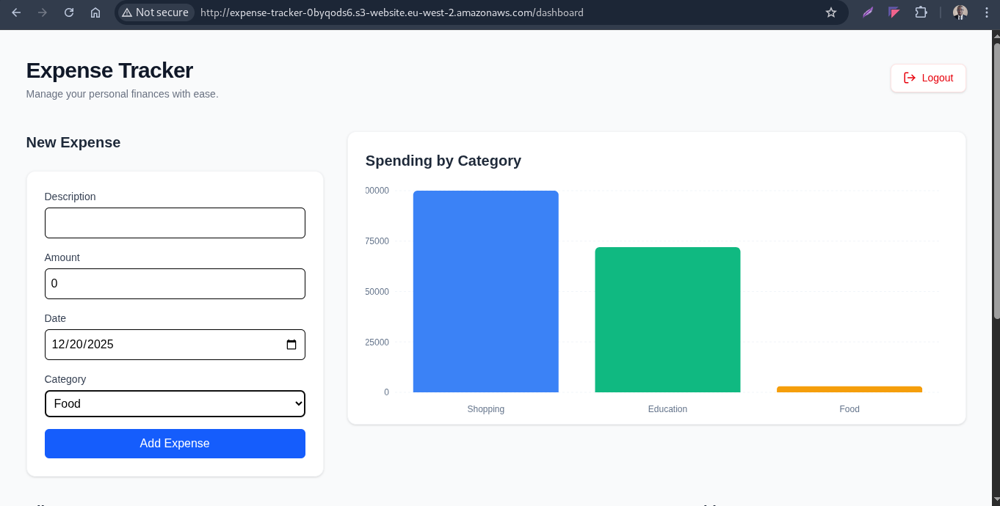

# Serverless Monorepo Personal Expense Tracker

A full-stack, serverless monorepo application built with **React**, **TypeScript**, and **AWS Lambda**. This project focuses on high performance, type safety across the stack, and elegant financial visualization.

## Prerequisites

Before starting, ensure you have the following installed on your machine:

- **Node.js**: `v20.x` or higher (LTS recommended)
- **pnpm**: `v9.x` or higher (`npm install -g pnpm`)
- **AWS CLI**: Configured with active credentials (`aws configure`)
- **MongoDB Atlas account**: Setup for your database connection
- **Serverless Framework**: for deployment (optional)

Check versions:

```bash
node -v
pnpm -v
aws --version
```

---

## Repository Structure

```
personal-expense-tracker/
├─ .github/             # CI/CD pipeline
├─ apps/
│ ├─ frontend/          # React frontend
│ └─ backend/           # Serverless backend (AWS Lambda)
├─ packages/
│ └─ types/             # Shared TypeScript types
├─ .gitignore
├─ pnpm-workspace.yaml
├─ package.json
└─ README.md
```

---

## Step-by-Step Setup

1. **Clone the Repository**

```bash
git clone https://github.com/PhilipOyelegbin/serverless-expense-tracker.git
cd serverless-expense-tracker
```

2. **Install Dependencies**

We use `pnpm` workspaces for efficient dependency management.

```bash
pnpm install
```

3. **Environment Configuration**

You need to create `.env` files in two locations:

**Frontend:** `apps/frontend/.env`

```env
VITE_BASE_API_URL=http://localhost:3000/dev  # Change after deployment
```

**Backend:** `apps/backend/.env`

```env
MONGODB_URI=your_mongodb_connection_string
JWT_SECRET=your_super_secret_key
```

---

## Local Development

Run the entire stack (Frontend + Backend) concurrently from the root directory:

```bash
pnpm dev
```

- **Frontend**: [localhost:5173](http://localhost:5173)
- **Backend (Local Lambda)**: [localhost:3000](http://localhost:3000)
- **Tests**: `pnpm test`

---

## Deployment

This project uses **Serverless framework** for Infrastructure as Code (IaC).

1. **Prepare application for deployemnent**

```bash
pnpm run build
```

2. **Deploy to Production**

```bash
pnpm run start
```

3. **Post-Deployment**

Once finished, the terminal will output the **API URL**. Copy this URL and update your `apps/frontend/.env` file:

```env
VITE_BASE_API_URL=https://your-api-url
```

---

## Troubleshooting

| Issue                                             | Cause                       | Solution                                                                         |
| ------------------------------------------------- | --------------------------- | -------------------------------------------------------------------------------- |
| **"Module not found"**                            | Symlinks broken in monorepo | Run `pnpm install` at the root again.                                            |
| **"Property 'toBeInTheDocument' does not exist"** | Vitest Types not loaded     | Ensure `apps/frontend/src/test/setup.ts` is imported in `vite.config.ts`.        |
| **403 Forbidden on API**                          | Missing Auth Header         | Ensure your `Authorization: Bearer <token>` is being sent in Axios interceptors. |
| **CORS Errors**                                   | API Gateway Config          | Check your Lambda response headers include `Access-Control-Allow-Origin`.        |
| **Argon2 Errors**                                 | Native dependency issue     | Specifically include argon2 with native bindings.        |

---

## 🧪 Testing

We use **Vitest** for a fast, modern testing experience.

- **Run all tests**: `pnpm test`
- **Watch mode**: `pnpm test:watch`

---

## CI/CD & Automation

To ensure a seamless development experience and maintain environmental hygiene, this project is fully integrated with **GitHub Actions**. This automation removes the need for manual deployments and helps manage AWS costs effectively.

### **Automated Workflows**

- **Continuous Integration**: Every push/pull-request to the `staging` branch triggers an automated pipeline that runs your Vitest suite, builds the frontend assets, and backend.

- **Continuous Deployment**: Every push/pull-request to the `main` branch triggers an automated pipeline that executes `serverless deploy --stage prod` and `aws s3 sync dist/ s3://expense-tracker-0byqods6 --delete`. This ensures your production environment always reflects the latest stable code.

- **Infrastructure Cleanup**: To avoid "infrastructure drift" and unnecessary AWS charges, a cleanup workflow is configured. This can be triggered manually or set to run automatically when a pull-request to `clean` branch is merged and closed, executing `aws s3 rm s3://expense-tracker-0byqods6 --recursive` and `serverless remove --stage prod` to tear down temporary stacks.

---

## Deployed Link

**GitHub Repo:** https://github.com/PhilipOyelegbin/serverless-expense-tracker

**Frontend Endpoint:** http://expense-tracker-0byqods6.s3-website.eu-west-2.amazonaws.com/dashboard

**Backend Endpoints:**
- POST: https://cf32apxaol.execute-api.eu-west-2.amazonaws.com/prod/users/signin
- POST: https://cf32apxaol.execute-api.eu-west-2.amazonaws.com/prod/users/signin
- GET: https://cf32apxaol.execute-api.eu-west-2.amazonaws.com/prod/expenses
- GET: https://cf32apxaol.execute-api.eu-west-2.amazonaws.com/prod/expenses/{id}
- POST: https://cf32apxaol.execute-api.eu-west-2.amazonaws.com/prod/expenses
- PUT: https://cf32apxaol.execute-api.eu-west-2.amazonaws.com/prod/expenses/{id}
- DELETE: https://cf32apxaol.execute-api.eu-west-2.amazonaws.com/prod/expenses/{id}
- GET: https://cf32apxaol.execute-api.eu-west-2.amazonaws.com/prod/expenses/total-spending-by-month
- GET: https://cf32apxaol.execute-api.eu-west-2.amazonaws.com/prod/expenses/spending-by-category 



---

### **Key Benefits**

- **Consistency**: Eliminates "it works on my machine" issues by deploying from a clean, standardized runner.
- **Cost Control**: Automated cleanup ensures you only pay for the resources you are actively using.
- **Reliability**: Integrated testing prevents broken code from ever reaching your production environment.

> **Note**: Ensure you have added your `AWS_ACCESS_KEY_ID`, `AWS_SECRET_ACCESS_KEY`, `MONGO_URI`, `JWT_SECRET`, and `VITE_BASE_API_URL` to your **GitHub Repository Secrets** for the workflows to authenticate correctly.

---
